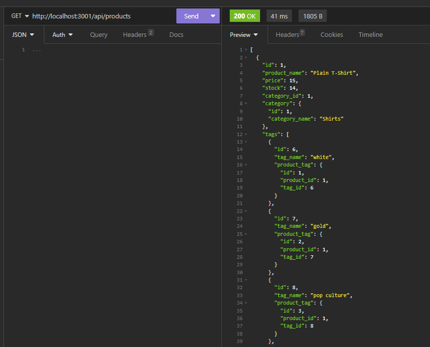

# E-commerce Back End Starter Code
Server Side e-commerce code

## Description
Uses Sequelize, and mysql2 for database manangement, Dotenv for database connection, and Express.

## Installation
Run  'npm i'  to install dependencies.

## Usage
log in to mysql and run 'source ./db/schema.sql'
leave mysql
Seed databases with  'node seeds/index.js'
Input 'npm start'  to initiate the program.

Link to github repository.
https://github.com/kingbgreen5/commerce_backend

Link to Video Tutorial.
https://drive.google.com/file/d/1cli65HEamHQJyz2clBueOvP2Kk4d3L1W/view
=======

## Credits
Starter code provided by Bootcamp lessons.
 
## License
MIT
